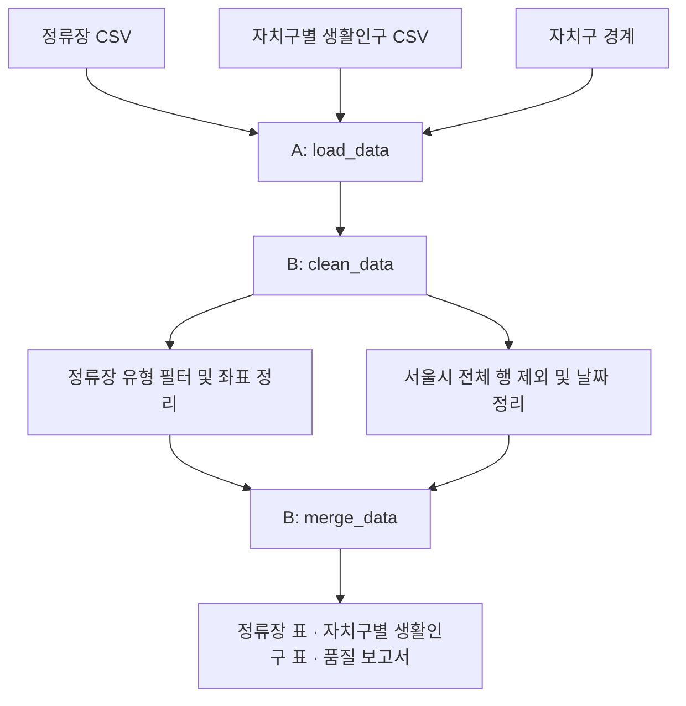

# 서울시 버스정류장 및 생활인구 데이터 수집·전처리

A와 B가 `DataLoader`를 나누어 구현하는 데이터 처리 저장소입니다. 저장소의 `data/raw/`에 포함한 CSV와 자치구 경계 파일을 읽고, 정류장에 자치구를 배정하여 분석용 데이터를 제공합니다. 팀원 모두 같은 원본 파일을 사용하며, 데이터 갱신은 파일 교체로 진행합니다.

## 역할 분담

| 담당자 | 담당 메서드 | 작업 | 전달 결과 |
| --- | --- | --- | --- |
| A — 데이터 파이프라인 | `load_data()` | 원본 파일 확보·저장, CSV·경계 파일 읽기, 경로·필수 컬럼 확인, 컬럼명 통일, 출처·기준시점 기록 | 정류장·생활인구·경계 데이터 묶음 |
| B — 데이터 정제 및 병합 | `clean_data()`, `merge_data()` | 자료형·결측·중복 처리, 정류소 유형 필터, 서울시 전체 행 제외, 좌표 기반 자치구 배정, 생활인구 연결 | 정류장 표, 자치구별 생활인구 표, 품질 보고서 |

A와 B는 아래 표준 컬럼과 반환 형식을 함께 사용합니다. A는 파일 누락·읽기 오류·컬럼 누락을, B는 데이터 값의 이상과 병합 오류를 담당합니다.

## 입력 데이터

아래 수치와 컬럼은 제공된 CSV를 확인한 결과입니다. 새로 수집한 데이터의 건수와 기간은 달라질 수 있습니다.

| 파일 | 행 수 | 한 행의 의미 | 인코딩 |
| --- | ---: | --- | --- |
| `서울시 버스정류소 위치정보.csv` | 11,236 | 정류소 하나 | CP949 |
| `자치구별 서울 생활인구(250m) 일별집계표.csv` | 35,672 | 날짜별 서울시 전체 또는 자치구 하나 | CP949 |

출처:

- [서울시 버스정류소 위치정보](https://data.seoul.go.kr/dataList/OA-15067/S/1/datasetView.do)
- [자치구별 서울 생활인구(250m) 일별집계표](https://data.seoul.go.kr/dataList/OA-23060/S/1/datasetView.do)

### 정류장 CSV

| 원본 컬럼 | 표준 컬럼 | 처리 기준 |
| --- | --- | --- |
| `노드 ID` | `source_node_id` | 문자열로 원본 보존. 예: `00001` |
| `정류소번호` | `stop_id` | 문자열로 보존. 예: `123000689` |
| `정류소명` | `stop_name` | 정류장 이름 |
| `X좌표` | `longitude` | 숫자로 변환. 파일 값은 경도 범위 |
| `Y좌표` | `latitude` | 숫자로 변환. 파일 값은 위도 범위 |
| `정류소 타입` | `stop_type` | 정류소 유형 필터에 사용 |

이 파일에서 `정류소번호`는 11,236개 모두 고유하며, 6개 컬럼에 빈 값은 없습니다. 다만 새 수집 데이터에도 동일한 검사를 수행합니다. `노드 ID`와 `정류소번호`의 이름만 보고 ARS-ID로 간주하거나 5자리 보정 규칙을 적용하지 않습니다.

| 정류소 타입 | 건수 |
| --- | ---: |
| 일반차로 | 6,251 |
| 마을버스 | 4,175 |
| 중앙차로 | 405 |
| 가로변시간 | 256 |
| 가로변전일 | 141 |
| 한강선착장 | 8 |

도로 버스정류장 분석의 기본 범위에서는 `한강선착장` 8개를 제외하고 나머지 11,228개를 사용합니다. 제외 건수와 기준을 품질 보고서에 기록합니다. 마을버스 정류장은 포함합니다.

정류장 CSV에는 자치구 코드·자치구명·기준일 컬럼이 없습니다. 자치구는 경계 데이터와 좌표를 연결하여 배정하고, 원본의 기준시점은 제공 정보에서 별도로 확인합니다.

### 생활인구 CSV

`250m`는 생활인구 산정의 기초 공간 단위입니다. 이 CSV는 이미 자치구별로 집계되어 있으므로 격자 데이터를 다시 합칠 필요가 없습니다.

| 원본 컬럼 | 표준 컬럼 | 처리 기준 |
| --- | --- | --- |
| `기준일ID` | `reference_date` | `YYYYMMDD`를 날짜로 변환 |
| `시구코드` | `district_code` | 5자리 문자열 |
| `시구명` | `district_name` | 자치구 이름 |
| `총생활인구수` | `living_population` | 기본 분석에 사용할 실수 값 |
| `주간인구수(09~18)` | `daytime_population` | 주간 비교용 실수 값 |
| `야간인구수(19~08)` | `nighttime_population` | 야간 비교용 실수 값 |
| `적재일시` | `loaded_date` | 자료 적재일. 분석 기준일과 구분 |

그 밖에 내국인·장기체류외국인·단기체류외국인 인구, 일최대·일최소 인구, 서울외유입인구, 자치구간이동인구, 기온·강수량, 요일 컬럼이 있습니다. 기본 처리에서는 위 표의 컬럼을 사용하고 나머지는 원본에 보존합니다.

- 기간: 2023-01-01 ~ 2026-10-04, 총 1,372일
- 날짜마다 서울시 전체 1행과 자치구 25행, 총 26행
- `시구코드 == "11000"`인 서울시 전체 행은 자치구 분석에서 제외
- 제외 후 34,300행이며, `기준일ID + 시구코드` 중복은 없음
- 기본 사용 컬럼에는 빈 값이 없지만 기상 컬럼에는 결측치가 있음

기상 컬럼의 결측치 때문에 생활인구 행 전체를 삭제하지 않습니다. 생활인구는 추정값으로 소수점이 있으므로 실수로 유지합니다. `총생활인구수`에 내국인·외국인 인구를 다시 더하지 않습니다. 주민등록인구는 이 CSV에 포함되어 있지 않습니다.

## 추가 연결 데이터

두 CSV에는 자치구 경계와 면적이 없습니다. A는 자치구 코드·이름·경계 도형이 있는 공간 데이터를 확보하고, B는 정류장 위치를 해당 경계와 연결합니다.

- 경계 데이터의 코드 체계를 생활인구의 `시구코드`와 맞춥니다.
- 정류장 좌표의 원본 좌표계를 명세로 확인한 뒤 경계 데이터와 통일합니다. 경도·위도 형태라는 사실만으로 좌표계를 확정하지 않습니다.
- 면적을 경계에서 계산할 경우 적합한 투영좌표계에서 계산하고 km²로 변환합니다.
- 주민등록인구를 사용하는 분석을 추가하려면 별도 주민등록인구 자료를 연결합니다. `총생활인구수`를 주민등록인구로 사용하지 않습니다.

## 처리 흐름과 DataLoader



| 메서드 | 입력 | 책임 | 출력 |
| --- | --- | --- | --- |
| `load_data()` | 저장소 내부 입력 파일 경로 | 파일 읽기, 필수 컬럼 검사, 표준 컬럼명 적용 | `bus_stops`, `living_population`, `districts` |
| `clean_data(raw)` | 수집 데이터 묶음 | 자료형, 중복, 결측, 분석 대상 정리 | 같은 구조의 정제 데이터 묶음 |
| `merge_data(clean)` | 정제 데이터 묶음 | 공간 매핑, 날짜·자치구 기준 생활인구 연결 | 최종 데이터와 `quality_report` |

### A — 파일 확보 및 읽기

- 두 CSV와 자치구 경계 파일을 확보하여 `data/raw/`에 저장하고 팀 저장소에 함께 공유합니다.
- 개인 PC의 다운로드 폴더 대신 프로젝트 폴더를 기준으로 입력 경로를 구성합니다.
- 파일 존재 여부와 필수 컬럼을 확인하고, 문제가 있으면 파일명과 원인을 포함한 오류를 전달합니다.
- 제공 CSV는 `encoding="cp949"`로 읽고 식별자 컬럼은 문자열로 지정합니다.
- 원본 컬럼을 위 표의 표준 컬럼명으로 변경하여 B에게 전달합니다.
- 자치구 경계는 공간 데이터로 읽고 원본 좌표계 정보를 보존합니다.
- 원본 파일은 수정하지 않고, 정제·병합 결과를 `data/processed/`에 따로 저장합니다.
- 파일 출처, 자료 기준시점, 내려받은 날짜, 인코딩을 `data/SOURCES.md`에 기록합니다.

### B — 정제

- `stop_id`, `source_node_id`, `district_code`는 문자열로 유지합니다.
- 날짜·좌표·생활인구를 올바른 자료형으로 변환하고 실패를 기록합니다.
- `한강선착장`과 서울시 전체 행을 분석 대상에서 제외합니다.
- 정류장 이름만으로 중복을 제거하지 않습니다. 같은 식별자의 값이 충돌하면 별도로 확인합니다.
- 생활인구 중복 기준은 `reference_date + district_code`입니다. 날짜가 다른 같은 자치구 행은 정상 데이터입니다.
- 좌표 오류는 매핑 대상에서 제외하고 기록합니다. 생활인구 결측은 0으로 대체하지 않습니다.

### B — 병합

1. 정류장 좌표를 자치구 경계에 매핑해 `district_code`를 부여합니다.
2. 미배정·다중 매칭 정류장을 기록하고, 하나의 정류장이 여러 구에 중복 반영되지 않도록 처리합니다.
3. 생활인구는 기본적으로 선택한 기준일의 25개 자치구 행을 사용합니다.
4. 자치구 목록을 기준으로 생활인구를 왼쪽 병합하여 누락된 구도 남깁니다.
5. 정류장 표와 자치구 표를 분리하여 전달합니다.

여러 날짜를 비교하는 경우 생활인구 표의 날짜를 유지합니다. 기간 대표값이 필요하면 자치구별 일별 값의 평균과 포함 일수를 함께 제공합니다. 날짜별 값을 단순 합산해 인구수로 사용하지 않습니다.

정류장에 생활인구 전체 날짜를 바로 병합하면 같은 정류장이 날짜 수만큼 늘어나므로 피합니다. 현재 정류장 목록을 과거 생활인구와 비교할 경우 정류장 기준시점을 함께 표시하며, 과거 정류장 분포를 재현한 것으로 해석하지 않습니다.

## 최종 전달 데이터

| 결과 | 한 행의 단위 | 주요 컬럼 |
| --- | --- | --- |
| 정류장 표 | 정류장 하나 | `stop_id`, `source_node_id`, `stop_name`, `longitude`, `latitude`, `stop_type`, `district_code` |
| 자치구 생활인구 표 | 기준일 × 자치구 | `reference_date`, `district_code`, `district_name`, `living_population`, `daytime_population`, `nighttime_population` |
| 자치구 공간 데이터 | 자치구 하나 | `district_code`, `district_name`, `geometry`, `area_km2` |
| 품질 보고서 | 처리 실행 한 번 | 수집·제외·중복·매핑 실패·인구 누락 건수 및 사유 |

정류장 기준시점, 생활인구 기준일 또는 집계기간, 출처, 수집 시각, 좌표계를 함께 전달합니다. 공간 데이터는 좌표계와 도형을 보존할 수 있는 형식으로 저장합니다.

## 저장소 구성

```text
project/
├── README.md
├── requirements.txt
├── main.py                 # 파일 읽기 → 정제 → 병합 실행
├── .gitignore
├── src/
│   └── data_loader.py      # A: load_data / B: clean_data, merge_data
└── data/
    ├── SOURCES.md          # 출처·기준시점·다운로드 날짜·인코딩
    ├── raw/
    │   ├── 서울시 버스정류소 위치정보.csv
    │   ├── 자치구별 서울 생활인구(250m) 일별집계표.csv
    │   └── districts.geojson  # 표준화한 자치구 경계 파일명
    └── processed/          # 최종 표·공간 데이터·품질 보고서
```

## 실행 방법

명령은 저장소 최상위 폴더에서 실행합니다. 아래 명령의 실행 진입점은 `main.py`입니다.

### 1. 환경 준비

Windows PowerShell:

```powershell
python -m venv .venv
.\.venv\Scripts\python.exe -m pip install -r requirements.txt
```

macOS / Linux:

```bash
python3 -m venv .venv
.venv/bin/python -m pip install -r requirements.txt
```

### 2. 입력 파일 확인

저장소의 `data/raw/`에 두 CSV와 `districts.geojson`이 있는지 확인합니다. 자치구 경계는 별도로 확보해야 하는 입력 파일입니다. 파일명을 변경했다면 `DataLoader`의 입력 경로도 함께 변경합니다.

분석 기준일은 생활인구 자료에 존재하는 날짜를 선택하고, 팀원 모두 같은 기준일을 사용합니다.

### 3. 실행

Windows PowerShell:

```powershell
.\.venv\Scripts\python.exe main.py
```

macOS / Linux:

```bash
.venv/bin/python main.py
```

`load_data()` → `clean_data()` → `merge_data()` 순서로 처리하고 결과를 `data/processed/`에 저장합니다.

## 통합 확인

- 저장소의 파일만으로 입력을 읽고 같은 표준 컬럼으로 전달하는가?
- 생활인구의 서울시 전체 행과 정류장의 한강선착장 제외 건수가 기록되는가?
- 선택한 기준일에 25개 자치구가 있고 날짜·자치구 중복이 없는가?
- 공간 매핑 후 정류장이 중복되거나 조용히 누락되지 않는가?
- 생활인구가 없는 자치구도 결과에 남고 결측 상태가 표시되는가?
- 정류장 기준시점과 생활인구 기준일이 구분되어 기록되는가?

## 파일 공유 및 갱신

1. A가 새 원본을 내려받아 컬럼과 자료 기준시점을 확인합니다.
2. `data/raw/`의 해당 파일을 교체하고 `data/SOURCES.md`를 갱신합니다.
3. B가 정제·병합을 다시 실행하고 기존 결과와 건수·누락 여부를 비교합니다.
4. 원본 변경과 처리 기준 변경을 커밋에 기록하고, 팀원들은 같은 버전을 받아 사용합니다.

`.gitignore`에는 가상환경과 임시 파일을 제외하되, 팀이 공유할 `data/raw/` 파일은 포함하지 않습니다. 발표·제출 시에는 사용할 데이터 버전과 분석 기준일을 고정합니다.
